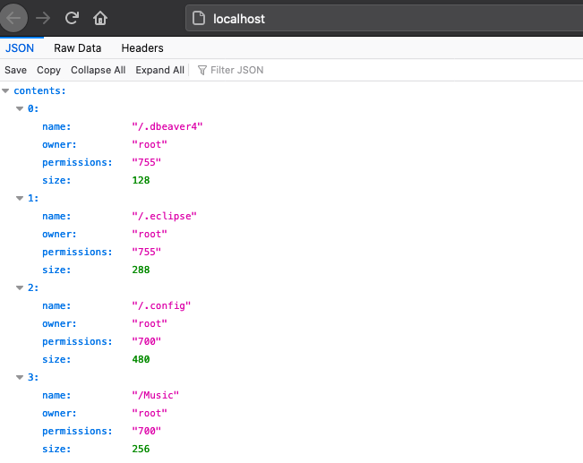

# RootCanal
Small REST API to display file information from a portion of the users's file system. 

## Quick start: 

```
docker-compose up -d
```
Will launch the application on port `80`.  You can then test with: 

```
curl localhost | jq
```

and see all the output: 

```
{
  "contents": [
  	...
    {
      "name": "/Music",
      "owner": "root",
      "permissions": "700",
      "size": 256
    },
    ...
    {
      "name": "/Pictures",
      "owner": "root",
      "permissions": "700",
      "size": 192
    },
    ...
   ]
}
```


or bring it up in your browser: 



## API Specifications

The path specified will be equivalant to the path on the filesystem with `ROOT_PATH` as the root of the directories. 


* `<app>/` - Display root path of mounted file system. 
* `<app>/somefile` - Display information about `somefile`.
* `<app>/somedir/anotherdir/anotherdir/...` - Display information about some file that is down the rabbit hole. 
* `<app>/somethingthatdoesn'texist` - `400` with error message. 


### Output

Will be either: 

```
{"error" : "This path does not exist"}
```

or, in the case of a directory: 

```
{"contents" : [{...}, {...}, ...]}
```
where each item of the array is a file or subdirectory object. 

or, finally, in the case of a file, like `~/Desktop/shopify.json` the metadata of the `shopify.json` file: 

```
{"contents" : 
	{
      "name": "/Desktop/shopify.json",
      "owner": "root",
      "permissions": "0644",
      "size": 178
	}
}
``` 

Note, that symbolic links are treated like files because some links may be linked outside the mounted filesystem.  You can change this in the code by using `stat` in stead of `lstat`.  

## How it works

The app is a python flask application that mounts a directory as specified by the `ROOT_PATH` variable. This `ROOT_PATH` variable is hardcoded in the `Dockerfile` as `/vol`.  Therefore, to pass in the directory, you mount the directory of your choice to the `/vol` directory when starting the docker file.  

The code uses several python built in functions including `os.path` and `getpwuid` to get information about the files. 
 

## Running the App

The app is a docker image.  The best way to run is to use docker compose: 

`docker-compose up -d`

This will run the application using your home directory as the root directory of the app.  To test the app is working you can run: 

`curl localhost` and you should see the contents of your `~/` directory. 

You can also use the `runit.sh` script to run from the commandline. This does the same as the `docker-compose` but doesn't include privileged directories which the compose file allows for. This is simply run with: 

```
runit.sh
```
Since the script is started with the `-P` flag, the port will be random.  Run: `docker ps` and you'll see the ports that are mapped to port `80` of the application.  You can then curl it locally: 

```
curl localhost:32773
```

which would be similar output to what is shown above. 

To change the mounted `ROOT_DIRECTORY` change line `2` in the `runit.sh` file: 

```diff
-  -v ~/:/vol \
+. -v ~/Desktop:/vol \
```

Now we are mounting the `~/Desktop` of our working machine to the application's `/vol` directory. 


## Build Information

The included `Makefile` will run all the tests then build and push the docker image. 

Simply run `make`

(although, the `make push` part will not work for you since you are not `vallard`. :-))


## Testing

There are a few test cases in to ensure different files are shown correctly.  These are in the `test_root_canal.py` file.  

```
pip install pytest
cd <project root>
pytest
```

Enjoy!
